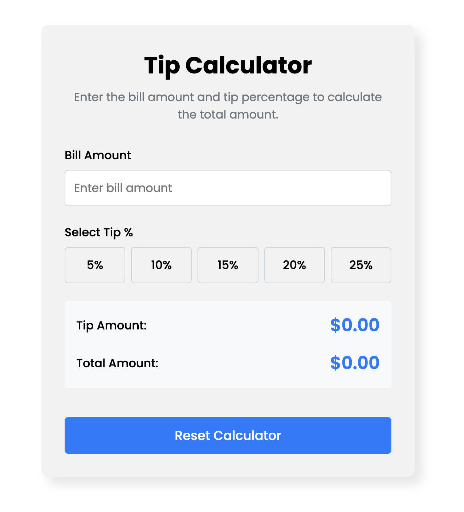

# Responsive Tip Calculator

A simple, elegant, and responsive tip calculator application built with vanilla HTML, CSS, and JavaScript. It allows users to input a bill amount, select a tip percentage, and see the calculated tip and total amount update in real time. This project was built with a focus on clean UI/UX, accessibility, and fundamental JavaScript concepts.

[**View Project Instructions on Google Docs**](https://docs.google.com/document/d/1IoHJYoI3eJxWq6dJdbsgEZdS9hof6cjpC9uXUNNtn7Q/edit?usp=sharing)




---

## Features

-   **Real-time Calculation**: Tip and total amounts update instantly as the user types the bill amount or selects a tip percentage.
-   **Flexible Tip Selection**: Users can easily choose from a set of predefined tip percentages (5%, 10%, 15%, 20%, 25%).
-   **Input Validation**: The application validates the bill amount to prevent non-numeric or negative values, providing clear, user-friendly error messages.
-   **Responsive Design**: Built with a mobile-first approach, the layout is fully responsive and looks great on all screen sizes, from small mobile phones to large desktop monitors.
-   **Reset Functionality**: A single "Reset" button clears all inputs, selections, and results, returning the calculator to its initial state.
-   **Accessible**: Designed with accessibility in mind, using semantic HTML (`<form>`, `<label>`, `<fieldset>`, `<output>`), proper ARIA attributes, and keyboard-navigable elements with clear focus states.

---

## Technologies Used

This project was built from scratch using foundational web technologies:

-   **HTML5**: Structured with semantic HTML for clarity, SEO, and accessibility.
-   **CSS3**: Styled using modern CSS, including:
    -   Flexbox and Grid for layout
    -   CSS Custom Properties (Variables) for easy theming and maintenance
    -   A mobile-first, responsive design approach
-   **Vanilla JavaScript (ES6+)**: All logic is written in plain JavaScript, with no external libraries or frameworks, to handle:
    -   DOM manipulation
    -   Event handling
    -   Calculations and input validation

---

## Project Structure

The codebase is organized into three distinct files, promoting a clear separation of concerns:

-   `index.html`: Contains the core structure and content of the calculator.
-   `style.css`: Provides all the styling, from layout and typography to colors and interactivity.
-   `script.js`: Implements all the application's logic and dynamic behavior.

---

## How to Use

To run this project locally:

1.  Clone this repository to your local machine:
    ```bash
    git clone <your-repository-url>
    ```
2.  Navigate into the project directory:
    ```bash
    cd tip-calculator
    ```
3.  Open the `index.html` file in your favorite web browser.

---

## Learning Goals

This project was an exercise in applying and reinforcing core front-end development skills, including:

-   **JavaScript Fundamentals**: Working with variables (`let`, `const`), data types, and type conversion (`parseFloat`, `parseInt`).
-   **DOM Manipulation**: Selecting and interacting with DOM elements to create a dynamic user experience.
-   **Event Handling**: Using event listeners (`input`, `change`, `click`) to respond to user actions in real-time.
-   **Modern JavaScript Practices**: Using `forEach` to efficiently attach event listeners to multiple elements.
-   **UI/UX and Accessibility**: Building an interface that is not only visually appealing but also usable and accessible to all users, including those relying on screen readers or keyboard navigation.
-   **Responsive Web Design**: Implementing a mobile-first CSS strategy to ensure a seamless experience across all devices. 